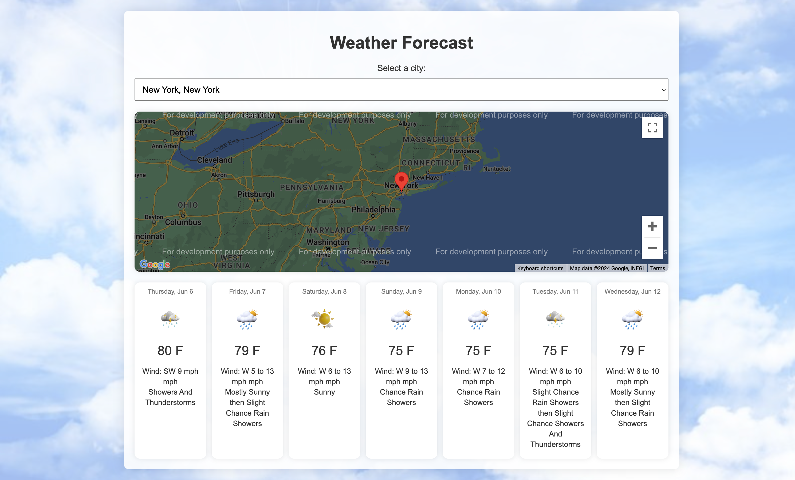

# Weather Forecast

This project is a web application designed to display the weather forecast for a select number of cities using the US government's REST API at https://api.weather.gov/ and the Google Maps API. The application provides a seamless and informative experience for users to get weather updates for different locations.

## Demo

Explore the functionality of the Weather Forecast platform by visiting: [weather-forecast](https://weather-version2.netlify.app/)

## Contact

For any inquiries or issues, please open an issue on the repository or contact aaungdev@outlook.com